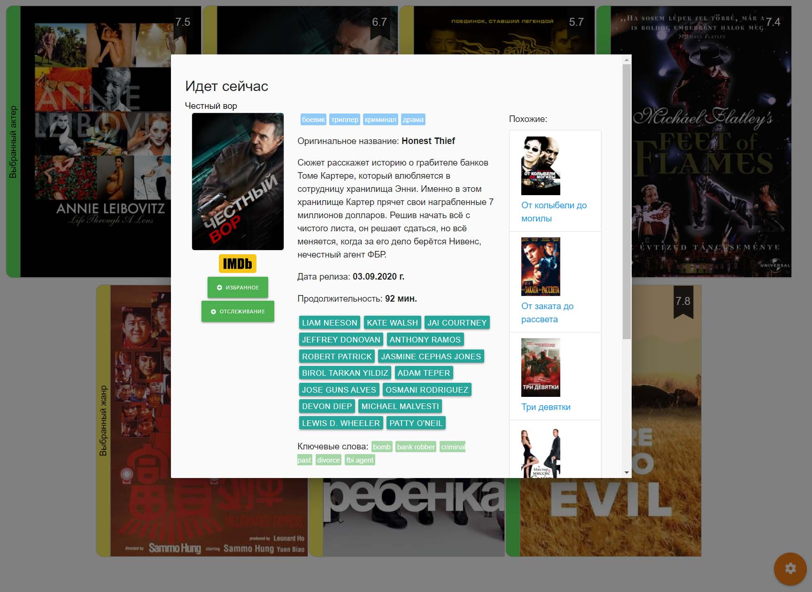

# MovieDice

Проект представляет собой пример использования React для отображения случайно выбранных фильмов с сайта https://www.themoviedb.org

Установка и запуск:

```
npm install
npm run serv
```

Открыть в браузере:

```
http://localhost:3000/
```

Пример отображения:





